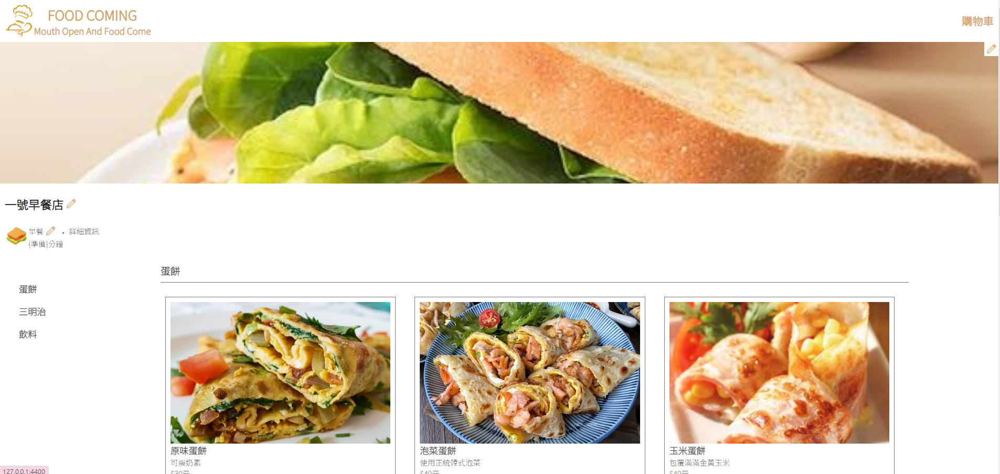
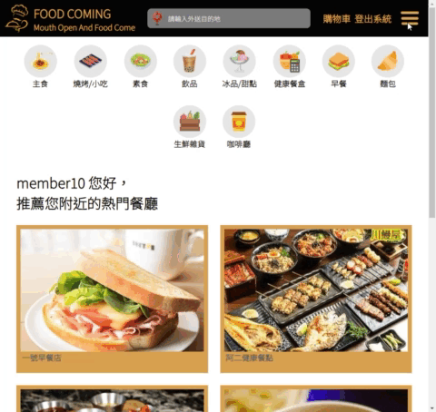
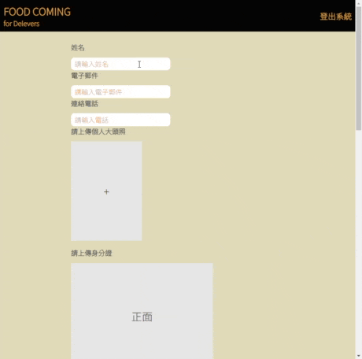

# foodcoming
website URL : https://formal.foodcoming.store
# About this project
This delivery project, inspired by the Uber Eats template, is structured into three main components: merchants, consumers, and delivery personnel. 

In the following sections, we will dive into each part to understand how they contribute to the overall functionality of the project.

__Enter Platform__\
As users access the website, the system will automatically retrieve their current location, proceeding to search for and display nearby stores.

__Member signup and login__

__Setting up merchant__
1. When on the index page, you'll notice a lines-icon. Clicking on this icon will reveal a button that allows you to set up store information.\

2. Fill the form.\
\

3. After accomplish the merchant file, click submit, and you'll get into your store page.\

__Setting up deliver__
1. When on the index page, you'll notice a lines icon. Clicking on this icon will reveal a button that allows you to set up deliver information.\

2. Fill the form.\

3. After successfully delivering the file, the website will redirect you to the index page. Here, you can click on the lines-icon, instead of the setting up deliver button, you will see entering your deliver page button. Upon entering, the system will automatically search for nearby orders based on your current position.\

__Consumer order__
1. When entering a store's page and selecting an item for purchase, the cart will automatically appear. If you regret selecting certain products, you can remove it from cart.\

2. After making the payment, the order will be stored in the database. If there are delivery personnel nearby, the order will be displayed on their page. Once a delivery person accepts the order, we will receive a notification.\
.gif>)

3. If the delivery person cancel this order, we also can receive the notification. If we choose keeping waiting, our order will release again.
.gif>)

# 雲端部屬

# 資料庫結構

