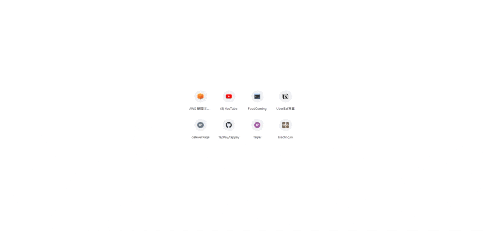
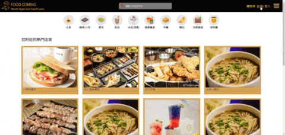
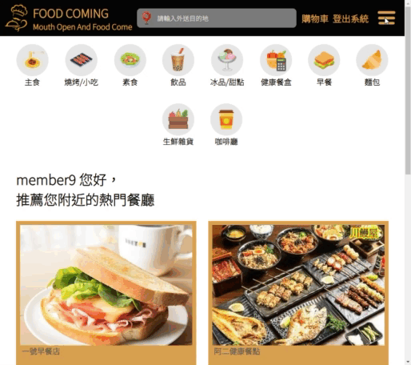
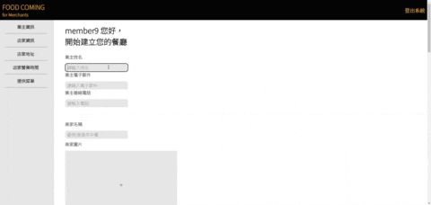

# foodcoming
# About this project
This delivery project, inspired by the Uber Eats template, is structured into three main components: merchants, consumers, and delivery personnel. 

In the following sections, we will dive into each part to understand how they contribute to the overall functionality of the project.

__Enter Platform__\
As users access the website, the system will automatically retrieve their current location, proceeding to search for and display nearby stores.

__Member signup and login__\

__Setting up merchant__
1. When on the index page, you'll notice a lines icon. Clicking on this icon will reveal a button that allows you to set up store information.\

2. Fill the form.\
\

# 雲端部屬

# 資料庫結構

# 測試網址
http://18.181.189.179:4400/
