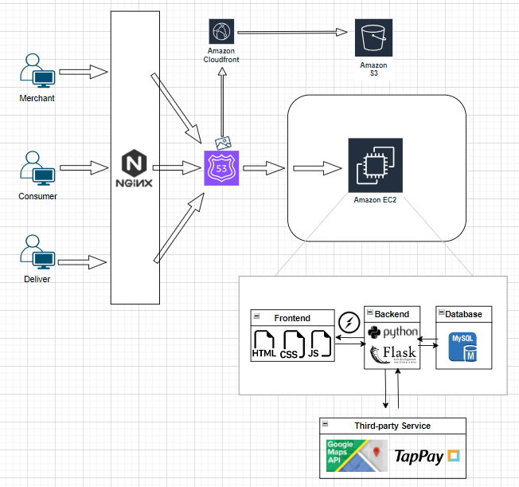

# foodcoming
website URL : https://formal.foodcoming.store
# About this project
This delivery project, inspired by the Uber Eats template.

As an online food delivery platform, the platform 
dynamically presents nearby restaurants to consumers based on their geolocation when entering the website. Upon successful purchase, the order is seamlessly integrated into the order database.

On the delivery driver page, the platform utilizes geolocation to display available orders. When a delivery driver accepts an order, the system initiates the delivery service for that specific order.
# Project Struct:

__Front-End Development :__\
Using HTML, CSS, and JavaScript, ensure an enjoyable ordering experience for customers.\
Follow MVC structure to build up JavaScript program, prioritizing readability and maintainability.

__Back-End Development :__\
Using Python Flask as my backend language framework.\
In addition to HTTP contracts, I leverage socket.io for real-time data transformation.\
Implemented a MySQL database, employing Database Normalization as the guiding principle for database structure design.

__Integration of Third-Party Services :__\
Utilize the Google Maps API to determine and track the locations of users, stores, and delivery personnel. in this project.\
Implemented TapPay for streamlined management of customer payments in the project.

__Cloud Deployment :__\
Utilize some AWS services such as VPC, EC2, S3, Cloudfront\
Using Nginx as reverse proxy of the domain.

__Version Control Tools  :__\
Implemented Git for version control, follw on git flow

# Database design :

# Details of the project :
This delivery project is structured into three main components: merchants, consumers, and delivery personnel. 

In the following sections, we will dive into each part to understand how they contribute to the overall functionality of the project.

## Enter Platform
As users access the website, the system will automatically retrieve their current location, proceeding to search for and display nearby stores.

## Setting up merchant
__Step 1__ \
When on the index page, you'll notice a lines-icon. Clicking on this icon will reveal a button that allows you to set up store information.

__Step 2__ \
Fill the form.

__Step 3__ \
After accomplish the merchant file, click submit, and you'll get into your store page.

## Setting up deliver
__Step 1__ \
When on the index page, you'll notice a lines icon. Clicking on this icon will reveal a button that allows you to set up deliver information.

__Step 2__ \
Fill the form.

__Step 3__ \
After successfully delivering the file, the website will redirect you to the index page. Here, you can click on the lines-icon, instead of the setting up deliver button, you will see entering your deliver page button. Upon entering, the system will automatically search for nearby orders based on your current position.

## Consumer order
__Step 1__ \
When entering a store's page and selecting an item for purchase, the cart will automatically appear. If you regret selecting certain products, you can remove it from cart.\

__Step 2__ \
After making the payment, the order will be stored in the database. If there are delivery personnel nearby, the order will be displayed on their page. Once a delivery person accepts the order, we will receive a notification.\
.gif)

__Step 3__ \
If the delivery person cancel this order, we also can receive the notification. If we choose keeping waiting, our order will release again.\
.gif)

